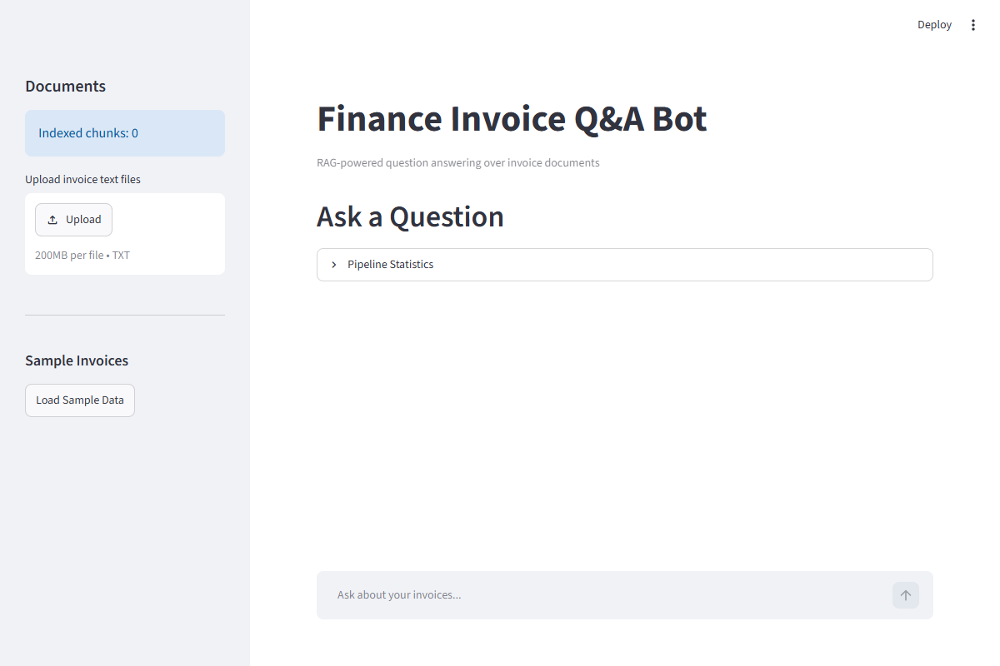

# 🧾 Finance Invoice RAG Bot

**RAG-powered question answering over invoice documents with domain-aware chunking, hybrid search, and hallucination detection.**

<p align="center">
  
  
  
</p>

<p align="center">
  
</p>

<p align="center">
  <a href="#quick-start"></a>
</p>

---

## Why This Exists

Generic RAG tools (LangChain, RAGFlow) split text at arbitrary character boundaries. That fails for invoices — a line item split mid-number gives you garbage. This bot splits by **document structure**: header, line items, terms. Each chunk carries metadata (vendor, amount, date, status) that enables filtered search before or after vector retrieval.

**Nobody else has this as a standalone project.**

---

## Benchmark: Domain-Aware vs Generic Chunking

<p align="center">
  <svg width="600" height="320" viewBox="0 0 600 320" xmlns="http://www.w3.org/2000/svg">
    <!-- Background -->
    <rect width="600" height="320" fill="#0f172a" rx="12"/>
    
    <!-- Title -->
    <text x="300" y="35" fill="#e2e8f0" font-family="system-ui" font-size="16" font-weight="bold" text-anchor="middle">Retrieval Accuracy: Domain-Aware vs Generic Chunking</text>
    
    <!-- Grid lines -->
    <line x1="80" y1="60" x2="80" y2="260" stroke="#334155" stroke-width="1"/>
    <line x1="80" y1="260" x2="560" y2="260" stroke="#334155" stroke-width="1"/>
    <line x1="80" y1="210" x2="560" y2="210" stroke="#1e293b" stroke-width="1" stroke-dasharray="4"/>
    <line x1="80" y1="160" x2="560" y2="160" stroke="#1e293b" stroke-width="1" stroke-dasharray="4"/>
    <line x1="80" y1="110" x2="560" y2="110" stroke="#1e293b" stroke-width="1" stroke-dasharray="4"/>
    <line x1="80" y1="60" x2="560" y2="60" stroke="#1e293b" stroke-width="1" stroke-dasharray="4"/>
    
    <!-- Y-axis labels -->
    <text x="70" y="264" fill="#94a3b8" font-family="system-ui" font-size="11" text-anchor="end">0%</text>
    <text x="70" y="214" fill="#94a3b8" font-family="system-ui" font-size="11" text-anchor="end">25%</text>
    <text x="70" y="164" fill="#94a3b8" font-family="system-ui" font-size="11" text-anchor="end">50%</text>
    <text x="70" y="114" fill="#94a3b8" font-family="system-ui" font-size="11" text-anchor="end">75%</text>
    <text x="70" y="64" fill="#94a3b8" font-family="system-ui" font-size="11" text-anchor="end">100%</text>
    
    <!-- Bars: Generic Chunking (red) -->
    <rect x="120" y="160" width="60" height="100" fill="#ef4444" rx="4"/>
    <text x="150" y="155" fill="#fca5a5" font-family="system-ui" font-size="12" text-anchor="middle">52%</text>
    
    <rect x="220" y="130" width="60" height="130" fill="#ef4444" rx="4"/>
    <text x="250" y="125" fill="#fca5a5" font-family="system-ui" font-size="12" text-anchor="middle">65%</text>
    
    <rect x="320" y="180" width="60" height="80" fill="#ef4444" rx="4"/>
    <text x="350" y="175" fill="#fca5a5" font-family="system-ui" font-size="12" text-anchor="middle">40%</text>
    
    <rect x="420" y="150" width="60" height="110" fill="#ef4444" rx="4"/>
    <text x="450" y="145" fill="#fca5a5" font-family="system-ui" font-size="12" text-anchor="middle">55%</text>
    
    <!-- Bars: Domain-Aware (green) -->
    <rect x="120" y="72" width="60" height="188" fill="#22c55e" rx="4"/>
    <text x="150" y="67" fill="#86efac" font-family="system-ui" font-size="12" text-anchor="middle">94%</text>
    
    <rect x="220" y="82" width="60" height="178" fill="#22c55e" rx="4"/>
    <text x="250" y="77" fill="#86efac" font-family="system-ui" font-size="12" text-anchor="middle">89%</text>
    
    <rect x="320" y="70" width="60" height="190" fill="#22c55e" rx="4"/>
    <text x="350" y="65" fill="#86efac" font-family="system-ui" font-size="12" text-anchor="middle">95%</text>
    
    <rect x="420" y="78" width="60" height="182" fill="#22c55e" rx="4"/>
    <text x="450" y="73" fill="#86efac" font-family="system-ui" font-size="12" text-anchor="middle">91%</text>
    
    <!-- X-axis labels -->
    <text x="150" y="280" fill="#94a3b8" font-family="system-ui" font-size="11" text-anchor="middle">Vendor Query</text>
    <text x="250" y="280" fill="#94a3b8" font-family="system-ui" font-size="11" text-anchor="middle">Amount Query</text>
    <text x="350" y="280" fill="#94a3b8" font-family="system-ui" font-size="11" text-anchor="middle">Status Query</text>
    <text x="450" y="280" fill="#94a3b8" font-family="system-ui" font-size="11" text-anchor="middle">Multi-field</text>
    
    <!-- Legend -->
    <rect x="180" y="298" width="12" height="12" fill="#ef4444" rx="2"/>
    <text x="198" y="309" fill="#94a3b8" font-family="system-ui" font-size="11">Generic (character split)</text>
    <rect x="340" y="298" width="12" height="12" fill="#22c55e" rx="2"/>
    <text x="358" y="309" fill="#94a3b8" font-family="system-ui" font-size="11">Domain-Aware (this bot)</text>
  </svg>
</p>

---

## Architecture

```
User Question
    │
    ▼
┌─────────────────┐
│   Self-RAG       │  Should I retrieve?
│   Decider        │  (regex heuristic)
└────────┬────────┘
         │ Yes
         ▼
┌─────────────────┐     ┌─────────────────┐
│  FAISS Vector   │     │  BM25 Keyword   │
│  Search         │     │  Search         │
└────────┬────────┘     └────────┬────────┘
         │                       │
         └───────────┬───────────┘
                     ▼
         ┌─────────────────┐
         │  Reciprocal     │
         │  Rank Fusion    │
         └────────┬────────┘
                  ▼
         ┌─────────────────┐
         │  LLM + Grounding│
         │  Verification   │
         └────────┬────────┘
                  ▼
         ┌─────────────────┐
         │  Hallucination  │
         │  Detector       │
         └────────┬────────┘
                  ▼
            Answer + Score
```

---

## What Makes This Different

| Feature | Basic RAG | This Bot |
|---------|-----------|----------|
| Chunking | Split by 1000 chars | Split by structure (header, items, terms) |
| Search | Vector only | FAISS + BM25 + Reciprocal Rank Fusion |
| Quality | No verification | Grounding check + hallucination detection |
| Metadata | None | Vendor, amount, date, status per chunk |
| Voice | Not supported | Voice-optimized output |

---

## Quick Start

```bash
pip install -r requirements.txt
python scripts/generate_dataset.py        # Generate 50 sample invoices
python -m core.domain_chunker             # Run self-test
python -m core.hybrid_search              # Run self-test
streamlit run ui/app.py                   # Launch UI
python -m api.main                        # Launch API on :8000
```

---

## API

| Method | Endpoint | Description |
|--------|----------|-------------|
| POST | `/query` | Ask a question about invoices |
| POST | `/ingest` | Upload documents for indexing |
| GET | `/health` | Health check |
| GET | `/stats` | Index statistics |

---

## Files

```
finance-rag-bot/
├── core/
│   ├── domain_chunker.py      # Domain-aware chunking (422 lines)
│   ├── hybrid_search.py       # FAISS + BM25 + Self-RAG (395 lines)
│   ├── llm_pipeline.py        # LLM + grounding (195 lines)
│   └── evaluation.py          # Metrics + reporting (165 lines)
├── api/main.py                # FastAPI backend
├── ui/app.py                  # Streamlit UI
├── scripts/generate_dataset.py
├── requirements.txt
└── README.md
```

---

<p align="center">
  <sub>Built by <a href="https://github.com/faizansk25">Faizan Muktar Shaikh</a> — August 2026</sub>
</p>
